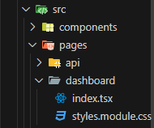
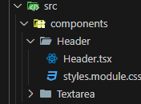

## Descrição

Este espaço é dedicado a anotações e resumos sobre recursos importantes do Next.js. O objetivo é criar uma referência prática para consultas futuras, facilitando a revisão de conceitos, funcionalidades e boas práticas. Aqui serão registrados pontos relevantes sobre estrutura de pastas, renderização (SSR, SSG, ISR), roteamento, API Routes, otimização de performance, e outros tópicos fundamentais. Essa coleção de informações será útil para resolver dúvidas rapidamente e acelerar o desenvolvimento de projetos com Next.js.

## Sumário

### Section 5

- [Nota 1 - Criando rotas no Next.js](#nota-1---criando-rotas-no-nextjs)
- [Nota 2 - Compartilhar componentes entre páginas](#nota-2---compartilhar-componentes-entre-paginas)
- [Nota 3 - Criando componentes](#nota-3---criando-componentes)
- [Nota 4 - Estrutura de componentes no Next](#nota-4---estrutura-de-componentes-no-next)
- [Nota 5 - Componentes internos NextJs](#nota-5---componentes-internos-nextjs)
- [Nota 6 - Criar sistema de autenticação usando provedores federados](#nota-6---criar-sistema-de-autenticacao-usando-provedores-federados)
- [Nota 7 - Utilizando GetServerSideProps](#nota-7---utilizando-getserversideprops)
- [Nota 8 - Criando componente textArea](#nota-8---componente-textarea)
- [Nota 9 - Adicionando Task ao firebase](#nota-9---adicionando-tasks-ao-firebase)

### Nota 1 - Criando rotas no Nextjs

Para criar paginas dentro do nextJs, nos criamos dentro de src/pages/"pasta com nome da rota".
Dentro da pasta que demos o nome da rota criamos um dois arquivos, o **index.tsx**, onde adicionaremos
as tags e componentes da pagina e o **styles.module.css** onde anexamos as classes de nossos objetos.



Acima vemos a rota dashbord criada

### Nota 2 - Compatilhar componentes entre páginas

[Voltar ao topo](#sumário)

O compartilhamento de componentes entre todas as rotas na nossa aplicação, no Next é feito no arquivo **src/pages/\_app.tsx**, como pode ser visto no exemplo abaixo.

```javascript
<>
  <header />
  <Component {...pageProps} />
</>
```

### Nota 3 - Criando componentes

[Voltar ao topo](#sumário)
Dentro de src criamos a pasta "Components" onde adicionamos os components que usaremos
na nossa aplicação, a estrura das pastas arquivos criados deve ser:



### Nota 4 - Estrutura de componentes no Next

[Voltar ao topo](#sumário)
A função que da origem aos componentes no Next é do tipo:

```javascript
export default function "Nome do componente/pagina" () {
    return (
        tags
    )
}
```

### Nota 5 - Componentes internos NextJs

[Voltar ao topo](#sumário)
Use componentes prontos do next como o `<Image/>` e o `<Head>`. Não se esqueça de
priorizar o carregamento da imagem com o atributo "priority" do componente `<Image/>`

### Nota 6 - Criar sistema de autenticação usando provedores federados

[Voltar ao topo](#sumário)
Para criar um sistema de login usando provedores confederados no next, usamos o pacote nextAuth

- No terminal digite:

  ```
      npm install next-auth
  ```

- Crie na pasta pages crie a rota **/pages/api/auth/[...nextauth].ts** !  
  Lembrando que o nome do arquivo na pasta deve ser idêntico ao mostrado acima, senão dará erro.

- Configure compartilhamento do estado da sessão fazendo:

  ```javascript
  import { SessionProvider } from "next-auth/react";

  export default function App({
    Component,
    pageProps: { session, ...pageProps },
  }) {
    return (
      <SessionProvider session={session}>
        <Component {...pageProps} />
      </SessionProvider>
    );
  }
  ```

- Agora devemos escolher no arquivo [...nextauth].ts qual o provedor queremos usar na
  nossa aplicação. Por exemplo, o github.

  ```javascript
  import NextAuth from "next-auth";
  import GithubProvider from "next-auth/providers/github";

  export const authOptions = {
    // Configure one or more authentication providers

    providers: [
      GithubProvider({
        clientId: process.env.GITHUB_ID,
        clientSecret: process.env.GITHUB_SECRET,
      }),
      // ...add more providers here
    ],
  };

  export default NextAuth(authOptions);
  ```

- As variaveis de ambiente **clientId, clientSecret** devem ser obtidas no site do provedor que
  escolheu usar no seu projeto e adicionadas ao arquivo .env que criamos na raiz do projeto.

- Para utilizar estado de autenticação do usuário fazermos.

  ```javascript
  import { useSession, signIn, signOut } from "next-auth/react";

  export default function Component() {
    const { data: session, status } = useSession();

    // Verificamos o status do usuário, logado ou carregando
    {
      status === "loading" ? (
        <>
          <p>Carregando...</p>
        </>
      ) : session ? (
        <div className={styles.greatingContainer}>
          <p className={styles.greatingUser}>Olá {userName} </p>
          <button className={styles.loginButton} onClick={() => signOut()}>
            Sair
          </button>
        </div>
      ) : (
        <button className={styles.loginButton} onClick={() => signIn("google")}>
          Acessar
        </button>
      );
    }
  }
  ```

### Nota 7 - Utilizando GetServerSideProps

[Voltar ao topo](#sumário)
O getServerSideProps no Next.js é usado para renderizar uma página no lado do servidor a cada requisição. Aqui está uma explicação simples:

**Quando usar?**

- Quando você precisa de dados dinâmicos que mudam a cada requisição.
- Para páginas que dependem de dados sensíveis ou que devem sempre estar atualizados.
- Exemplo: páginas com informações de usuários logados, dados que vêm de uma API que muda com frequência, ou exibição de dados baseados na localização do usuário.

**Por que usar?**

- Garante que os dados estão sempre atualizados no momento em que o usuário acessa a página.
- É útil para SEO, porque os dados já estão disponíveis no HTML gerado no servidor.

**Como usar?**

- O getServerSideProps é uma função exportada dentro de uma página no Next.js.
- Ele roda no servidor, não no cliente.
- Retorna os dados como props, que o componente da página pode usar.

**Exemplo**

```javascript
export async function getServerSideProps(context) {
  // Fetch de dados no servidor
  const res = await fetch("https://api.example.com/data");
  const data = await res.json();

  // Retorna os dados como props
  return {
    props: {
      data, // Será acessível no componente
    },
  };
}

export default function Page({ data }: { data: "tipo de dado" | null }) {
  return (
    <div>
      <h1>Dados do servidor:</h1>
      <pre>{JSON.stringify(data, null, 2)}</pre>
    </div>
  );
}
```

Todo processo mostrado acima é feito no servidor, ele envia a página já pronta para o navegador imprimir em tela

**Exemplo 2 - Usando na autenticação com provedores Federados**

No exemplo abaixo, vemos como verificar o estado de autenticação do usuário para saber se ele tem acesso a determinada rota.

```javascript
import { GetServerSideProps } from "next";
import { getSession } from "next-auth/react";

// Executado sempre do lado do servidor
export const getServerSideProps: GetServerSideProps = async ({ req }) => {
  const session = await getSession({ req }); // Aqui obtemos os dados da sessão do usuário

  if (!session?.user) {
    return {
      redirect: {
        destination: "/",
        permanent: false,
      },
    };
  }

  return {
    props: {},
  };
};
```

### Nota 8 - Componente textArea

[Voltar ao topo](#sumário)
Aqui criamos o componente textArea que será utilizado bastante dentro da nossa aplicação, e em função disso, usamos
a propriedade `{ ...rest }: HTMLProps<HTMLTextAreaElement>` uma vez que queremos deixar que o desenvolvedor atribua
qualquer propriedade ao componente via `<TextArea placeholder={...}/>`. A diretiva `HTMLProps<HTMLTextAreaElement` garante que o textArea não possa receber nenhum outro tipo de atributo que não seja o da tag textArea.

```javascript
import { HTMLProps } from "react";
import styles from "./styles.module.css";

export default function Textarea({ ...rest }: HTMLProps<HTMLTextAreaElement>) {
  return (
    <textarea className={styles.textarea} name="" id="" {...rest}></textarea>
  );
}
```

### Nota 9 - Adicionando Tasks ao firebase

[Voltar ao topo](#sumário)

Aqui vamos usar o firebase para salvar nossas tarefas, para isso precisamos instalar o pacote do firebase na nossa aplicação e configurar um projeto no firebase

    npm i firebase

Acesse o site do firebase, e crie um projeto. Após criar esse projeto, integre-o ao nextJS.

Na pasta `src` crie uma pasta chamada **firebase** e dentro dela um arquivo chamado **firebaseConnection.ts**. Dentro
desse arquivo, vamos adicinar o código de integração que recebemos no momento da criação do projeto no firebase.

```javascript
import { initializeApp } from "firebase/app";

import { getFirestore } from "firebase/firestore"; // importamos o FireStore

const firebaseConfig = {
  apiKey: "Dados sigilosos"
  authDomain: "Dados sigilosos"
  projectId: "Dados sigilosos"
  storageBucket: "Dados sigilosos"
  messagingSenderId: "Dados sigilosos"
  appId: "Dados sigilosos"
};

const app = initializeApp(firebaseConfig);

const db = getFirestore(app); // Inicializamos base de dados

export default { db }; // importamos base de dados
```
